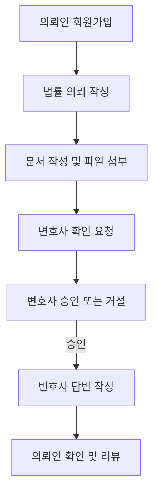

# 🧾 Simple Law Frontend

> 변호사와 의뢰인을 쉽고 빠르게 연결해주는 비대면 법률 매칭 플랫폼  
> React 기반 웹 애플리케이션 + JWT 인증 + AWS 배포 + CI/CD 자동화

---

## 📌 프로젝트 개요

**Simple Law**는 의뢰인과 변호사가 온라인에서 손쉽게 소통하고 문서를 주고받을 수 있는  
**법률 서비스 매칭 플랫폼**입니다.  

의뢰인은 법률 의뢰를 등록하고, 변호사는 이를 검토 및 답변할 수 있도록 구성되어 있습니다.  
문서 기반 의뢰부터 파일 업로드, 계정 승인, 리뷰까지 법률 서비스의 A-Z를 담고자 기획된 프로젝트입니다.

> ⚠️ 본 프로젝트는 개발 도중 중단되었으나, 기여한 기능들은 제 실무 역량을 보여주는 좋은 사례입니다.

---

## 🌟 담당 역할 및 주요 기여

### ✅ 인증 시스템 및 세션 관리
- `Redux Toolkit + Cookie` 조합으로 로그인 상태 관리
- Access/Refresh Token 분리 저장 및 자동 갱신 처리
- 세션 만료 시 사용자에게 메시지 표시

### ✅ 의뢰 작성/검토 기능
- `React Hook Form + Yup` 기반 실시간 유효성 검사 적용
- 에디터(`ReactQuill`)와 `Ant Design`을 조합해 문서 + 파일 첨부 기능 구현
- 파일 확장자, 용량 제한 기능 포함

### ✅ CI/CD 자동화 및 인프라 마이그레이션
- GitHub Actions로 자동 배포 설정
- 기존 Vercel → AWS (EC2 + ECR + Elastic Beanstalk) 마이그레이션 진행
- 비용 최적화를 위한 dev/prod 환경 분리

### ✅ 프로젝트 초기 세팅 및 구조 설계
- Redux Toolkit 및 폴더 구조 설계
- ESLint / Prettier / Tailwind 설정 및 프로젝트 컨벤션 정리

---

## 🔄 주요 사용자 흐름



---

## 👥 역할별 기능 요약

| 사용자 | 기능 |
|--------|------|
| **의뢰인** | - 회원가입/로그인<br>- 문서 작성 및 파일 업로드<br>- 변호사 요청/조회<br>- 답변 확인 및 평가 |
| **변호사** | - 가입 후 관리자 승인 대기<br>- 의뢰 수락/거절 처리<br>- 답변 작성 및 파일 첨부<br>- 계정 정보 관리 |

> 어드민 기능은 다른 팀원이 담당하였습니다.

---

## 🛠 사용 기술 스택

| 분야 | 기술 |
|------|------|
| **Frontend** | React, TypeScript, Tailwind CSS, Ant Design |
| **상태 관리** | Redux Toolkit, React Hook Form |
| **유효성 검사** | Yup |
| **에디터/업로더** | ReactQuill, Ant Design Upload |
| **배포/인프라** | AWS EC2, ECR, Elastic Beanstalk, GitHub Actions |
| **기타** | Docker, ESLint, Prettier, Postman, Digger |

---

## 📂 폴더 구조 요약

```
📦 src
├── api/         # API 호출 함수
├── components/  # 공통 컴포넌트
├── pages/       # 페이지 컴포넌트
├── redux/       # 상태 관리 (store, slice)
├── hooks/       # 커스텀 훅
├── types/       # 타입 정의
├── utils/       # 유틸 함수
└── styles/      # 글로벌 스타일, Tailwind 설정
```

---

## 🧪 실행 방법

```bash
# 의존성 설치
yarn install

# 개발 서버 실행
yarn dev

# JSON 서버 실행 (mock API)
yarn server

# 병렬 실행
yarn dev:all
```

---

## 🙋🏻‍♀️ 담당자: 송다영 (Frontend Developer)

> 전체 프론트엔드 구조 설계,  
> 인증 및 상태 관리 시스템 구축,  
> 파일 업로드/문서 작성 기능 구현,  
> 인프라 마이그레이션 및 자동화 파이프라인 설정을 담당했습니다.
